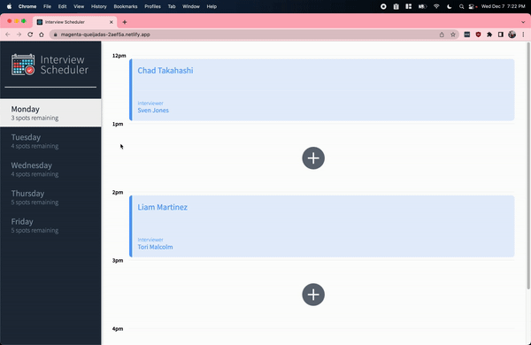
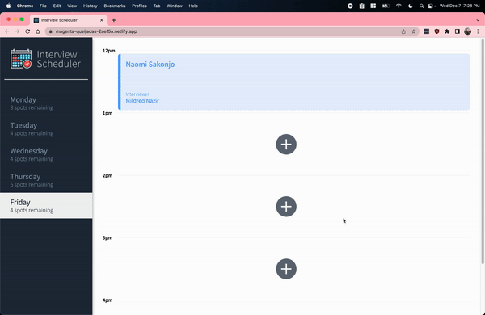
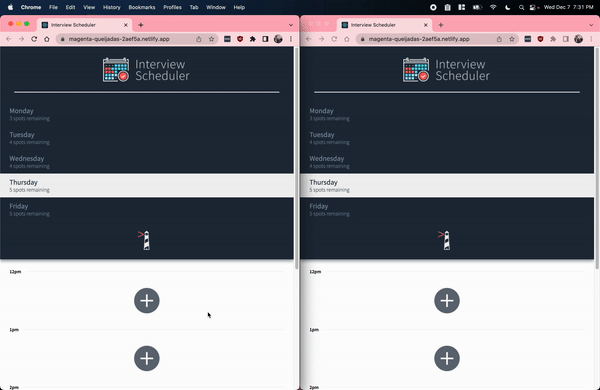

# [Interview Scheduler](https://magenta-queijadas-2aef5a.netlify.app/)
The Scheduler client application created using Create React App. This app allows users to book, edit or cancel interviews instantly, and Users can see the live updates of the available spots. It is deployed on the cloud using Netlify and Railway, and can be accessed [here](https://magenta-queijadas-2aef5a.netlify.app/).
## How to use Scheduler
Create an appointment:
<br />


Edit an appointment:
<br />


Delete an appointment:
<br />


Live updates!
<br />


## Features
 - Single page application (SPA) built using **React** and **Axios**.
 - **Storybook** is used for UI development.
 - **Express** is the basis for the API server application.
 - Data is persisted by the API server using a **PostgreSQL** database.
 - **Jest** tests are used through the development of the project.
 - **Cypress** tests are used for E2E testing.
 - The client application communicates with a WebSocket server.

## Local Setup

Install dependencies with `npm install`.

## Running Webpack Development Server

```sh
npm start
```

## Running Jest Test Framework

```sh
npm test
```

## Running Storybook Visual Testbed

```sh
npm run storybook
```
